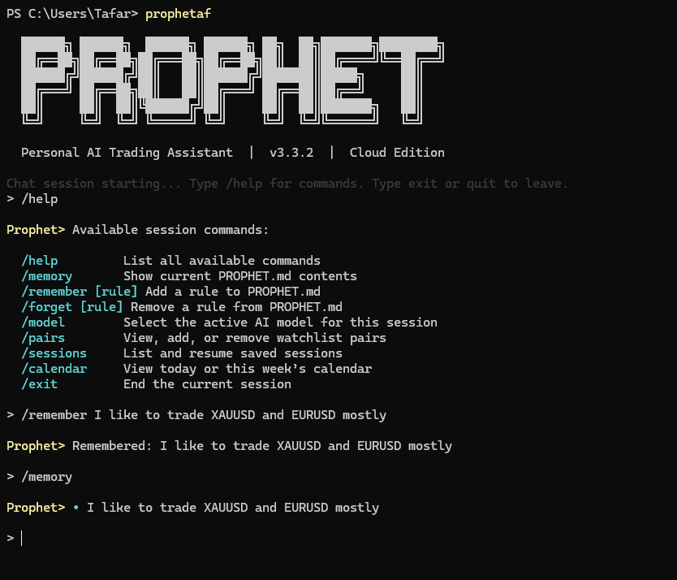

# Prophet

Personal AI Trading Assistant

## What Prophet Is

Prophet is a CLI-based personal AI hedge fund terminal that combines LangChain agents, real-time market data, and a structured trading methodology for discretionary FX decision support.

## Installation

```bash
npm install -g prophetaf
prophetaf
```

## Features

- Economic calendar with today/week views and pair-aware event warnings
- Macro news analysis via live web search when current context is required
- `PROPHET.md` personal memory (`/memory`, `/remember`, `/forget`)
- Multi-pair setup ranking to focus on the strongest current watchlist opportunity
- Session resume with recap and recent conversation history
- Live AI reasoning display during agent tool execution
- SSE streaming chat responses from backend to CLI
- Interactive selectors for models, pairs, sessions, and calendar views

## Trading Methodology

- Markets: XAUUSD and major FX pairs (default watchlist includes XAUUSD, EURUSD, GBPUSD, USDJPY, USDCHF)
- Top-down structure: H1 bias + M15 setup execution
- Setup confluence model:
- Fair Value Gap (FVG) detection with minimum gap threshold
- Fibonacci retracement zone checks (`0.5`, `0.618`, `0.705`, `0.786`)
- Liquidity sweep detection during active sessions
- Score-based setup surfacing and ranking to prioritize high-quality opportunities

## Slash Commands (v4)

| Command | Description |
| --- | --- |
| `/help` | List all available commands |
| `/memory` | Show current PROPHET.md contents |
| `/remember [rule]` | Add a rule to PROPHET.md |
| `/forget [rule]` | Remove a rule from PROPHET.md |
| `/model` | Select the active AI model for this session |
| `/pairs` | View, add, or remove watchlist pairs |
| `/sessions` | List and resume saved sessions |
| `/calendar` | View today or this week’s calendar |
| `/exit` | End the current session |

## Architecture Overview

`npm CLI client` -> `Cloud Run FastAPI backend` -> `LangChain agent` -> `OANDA/AlphaVantage/Finnhub data` -> `Gemini/OpenAI`

## Contributing

This project is actively evolving. Contributions and practical feedback are welcome.

## License

MIT License. See [LICENSE](LICENSE).
